# PHP-Dasar

This project is an assignment from my class
#### NIM : 312110103
#### Kelas : TI.21.A2
#### MatKul : Pemrograman Weh 2

### Latihan
Ini adalah Latihan 1
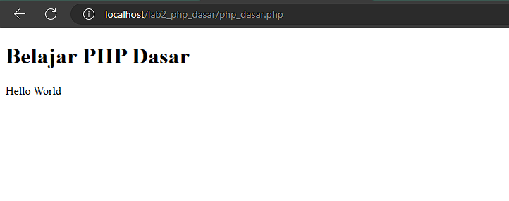

### Code

```php
<!DOCTYPE html>
<html lang="en">
<head>
    <meta charset="UTF-8">
    <title>PHP Dasar</title>
</head>
<body>
  <h1>Belajar PHP Dasar</h1>
  <?php
    echo "Hello World";
  ?>
</body>

</html>
```
### Latihan
Ini adalah Latihan 2 <br>
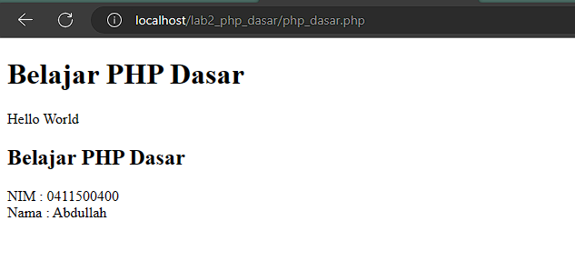

### Code

```php
<!DOCTYPE html>
<html lang="en">

<head>
    <meta charset="UTF-8">
    <title>PHP Dasar</title>
</head>

<body>
    <h1>Belajar PHP Dasar</h1>
    <?php
    echo "Hello World";
    ?>
    <h2>Belajar PHP Dasar</h2>
    <?php
    $nim = "0411500400";
    $nama = 'Abdullah';
    echo "NIM : " . $nim . "<br>";
    echo "Nama : $nama";
    ?>
</body>

</html>
```
### Latihan
Ini adalah Latihan 3 <br>
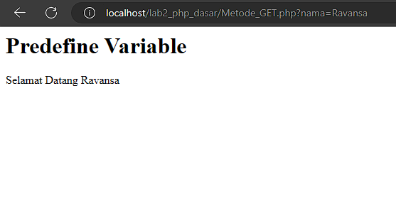

### Code

```php
<!DOCTYPE html>
<html lang="en">
<head>
    <meta charset="UTF-8">
    <title>Document</title>
</head>
<body>
  <h1>Predefine Variable</h1>
  <?php
    echo 'Selamat Datang ' . $_GET['nama'];
  ?>
</body>
</html>
```

### Latihan
Ini adalah Latihan 4
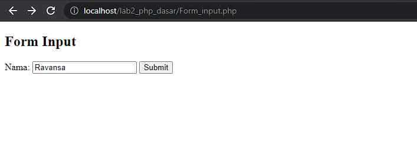
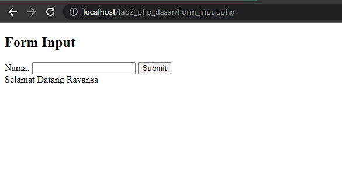
### Code

```php
<!DOCTYPE html>
<html lang="en">

<head>
    <meta charset="UTF-8">
    <title>Document</title>
</head>

<body>

    <body>
        <h2>Form Input</h2>
        <form method="post">
            <label>Nama: </label>
            <input type="text" name="nama">
            <input type="submit" name="kirim">
        </form>
        <?php
        if (isset($_POST["kirim"])) {
            echo 'Selamat Datang ' . $_POST['nama'];
        }
        ?>
    </body>
</body>

</html>
```
### Latihan
Ini adalah Latihan 5 <br>
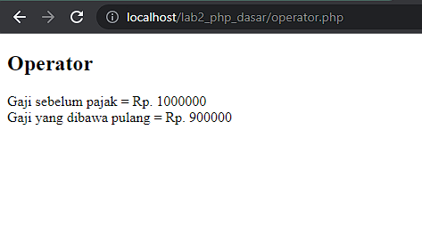

### Code

```php
<!DOCTYPE html>
<html lang="en">
<head>
    <meta charset="UTF-8">
    <title>Document</title>
</head>
<body>
  <h2>Operator</h2>
  <?php
    $gaji = 1000000;
    $pajak = 0.1;
    $thp = $gaji - ($gaji*$pajak);
    echo "Gaji sebelum pajak = Rp. $gaji <br>";
    echo "Gaji yang dibawa pulang = Rp. $thp";
  ?>
</body>
</html>
```
### Latihan
Ini adalah Latihan 6 <br>
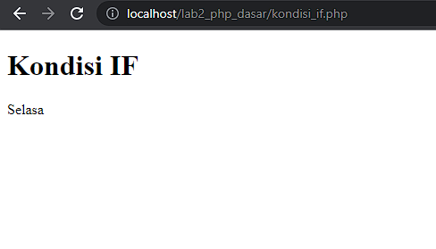

### Code

```php
<!DOCTYPE html>
<html lang="en">

<head>
    <meta charset="UTF-8">
    <title>Document</title>
</head>

<body>
    <h1>Kondisi IF</h1>
    <?php
    $nama_hari = date("1");
    if ($nama_hari == "Sunday") {
        echo "Minggu";
    } elseif ($nama_hari == "Monday") {
        echo "Senin";
    } else {
        echo "Selasa";
    }
    ?>
</body>

</html>
```
### Latihan
Ini adalah Latihan 7 <br>
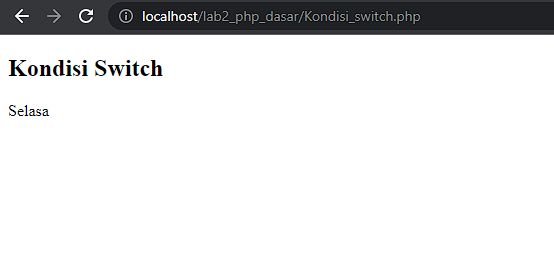

### Code

```php
<!DOCTYPE html>
<html lang="en">
<head>
    <meta charset="UTF-8">
    <title>Document</title>
</head>
<body>
  <h2>Kondisi Switch</h2>
  <?php
    $nama_hari = date("l");
    switch ($nama_hari) {
      case "Sunday":
        echo "Minggu";
        break;
      case "Monday":
        echo "Senin";
        break;
      case "Tuesday":
        echo "Selasa";
        break;
      default:
        echo "Sabtu";
    }
  ?>
</body>
</html>
```
### Latihan
Ini adalah Latihan 8
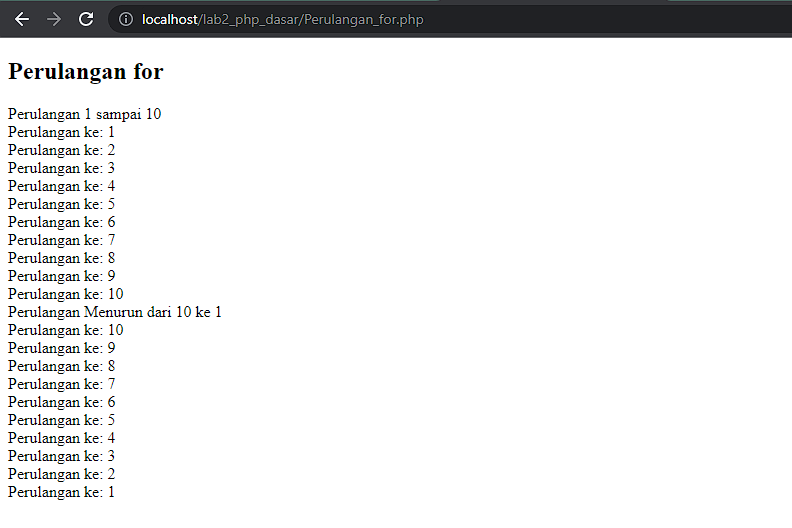

### Code

```php
<!DOCTYPE html>
<html lang="en">

<head>
    <meta charset="UTF-8">
    <title>Document</title>
</head>

<body>
    <h2>Perulangan for</h2>
    <?php
    echo "Perulangan 1 sampai 10 <br />";
    for ($i = 1; $i <= 10; $i++) {
        echo "Perulangan ke: " . $i . '<br />';
    }
    echo "Perulangan Menurun dari 10 ke 1 <br />";
    for ($i = 10; $i >= 1; $i--) {
        echo "Perulangan ke: " . $i . '<br />';
    }
    ?>
</body>

</html>
```
### Latihan
Ini adalah Latihan 9
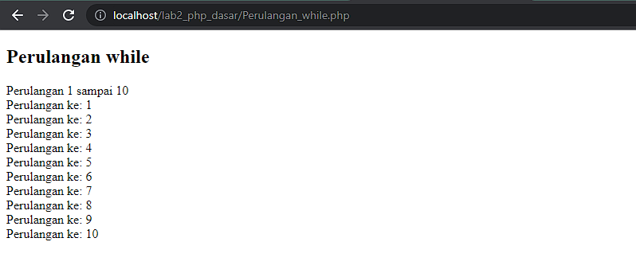

### Code

```php
<!DOCTYPE html>
<html lang="en">
<head>
  <meta charset="UTF-8">
  <title>Document</title>
</head>
<body>
  <h2>Perulangan while</h2>
  <?php
    echo "Perulangan 1 sampai 10 <br />";
    $i = 1;
    while ($i <= 10) {
      echo "Perulangan ke: " . $i . '<br />';
      $i++;
    }
  ?>
</body>
</html>
```
### Latihan
Ini adalah Latihan 10 <br>
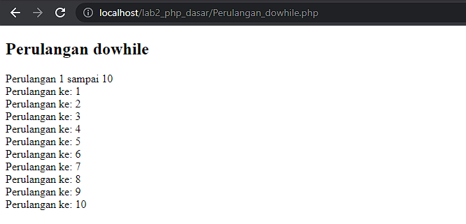

### Code

```php
<!DOCTYPE html>
<html lang="en">
<head>
    <meta charset="UTF-8">
    <title>Document</title>
</head>
<body>
  <h2>Perulangan dowhile</h2>
  <?php
    echo "Perulangan 1 sampai 10 <br />";
    $i = 1;
    do {
      echo "Perulangan ke: " . $i . '<br />';
      $i++;
    } while ($i <= 10);
  ?>
</body>
</html>
```
### Latihan
Ini adalah Latihan Form Input <br>
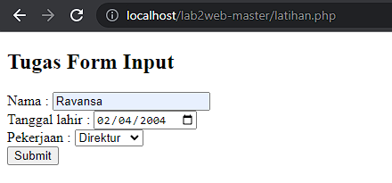
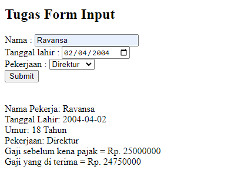

### Code

```php
<!DOCTYPE html>
<html lang="en">

<head>
    <meta charset="UTF-8">
    <title>Pemrograman WEB 2</title>
    <link rel="stylesheet" type="text/css">
</head>

<body>
    <h2>Tugas Form Input</h2>
    <form method="post" style="align-items: center;">
        <label for="nama">Nama :</label>
        <input type="text" name="nama" required>
        <br>
        <label for="tanggal_lahir">Tanggal lahir :</label>
        <input type="date" name="tgl_lahir" required>
        <br>
        <label for="pekerjaan">Pekerjaan :</label>
        <select name="pekerjaan">
            <option value="">- PILIH -</option>
            <option value="Direktur">Direktur</option>
            <option value="Manager">Manager</option>
            <option value="Staff">Staff</option>
        </select>
        <br>
        <button type="submit" name="submit" value="submit">Submit</button>
    </form>
    <?php

    if (isset($_POST['submit'])) {
        $nama = $_POST['nama'];
        $tgl_lahir = $_POST['tgl_lahir'];
        $pekerjaan = $_POST['pekerjaan'];
        $today = date_create(date("Y-m-d"));
        $birth = date_create($tgl_lahir);
        $umur = date_diff($today, $birth)->y;
        switch ($pekerjaan) {
            case "Direktur":
                $gaji = 25000000;
                $pajak = 0.01;
                $thp = $gaji - ($gaji * $pajak);
                break;
            case "Manager":
                $gaji = 15000000;
                $pajak = 0.01;
                $thp = $gaji - ($gaji * $pajak);
                break;
            case "Staff":
                $gaji = 6000000;
                $pajak = 0.01;
                $thp = $gaji - ($gaji * $pajak);
                break;
            default:
                $gaji = 0;
                break;
        }
        echo "<br><br>";
        echo "Nama Pekerja: " . $nama . "<br>";
        echo "Tanggal Lahir: " . $tgl_lahir . "<br>";
        echo "Umur: " . $umur . " Tahun<br>";
        echo "Pekerjaan: " . $pekerjaan . "<br>";
        echo "Gaji sebelum kena pajak = Rp. $gaji <br>";
        echo "Gaji yang di terima = Rp. $thp";
    }
    ?>
</body>

</html>
```